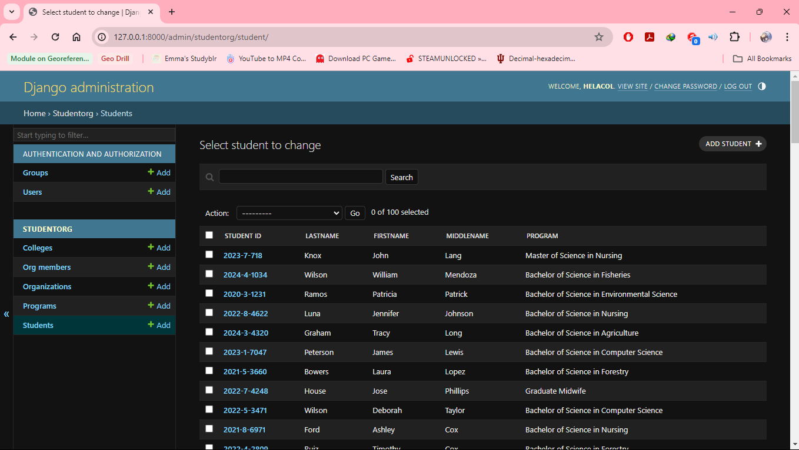

# Starting Django 
---

---

Title: Django

Author:
  - Kyla Mae G. Pagkaliwangan
  - Tracer Baiddin
    
Date: _April 2, 2024_

---

# Introduction
---
This is a **Django** projectsite that you can use as the staring point to develop your own and deploy it.

## What has been done for you
---
This is a minimal Django project. It was created with these step:

1. Create a VirtualEnv
2. Manually install Django and other dependencies
3. `pip freeze > requirements.txt`
4. `django-admin startproject projectsite .`
5. Update `projectsite/settings.py` some part of `INSTALLED_APPS`
4. `./manage.py startapp studentorg`, to create the welcome page's app

## Local development
---
To run this project in your development machine, follow these steps:

1. create repo and clone.
2. Create a development database:
    `./manage.py migrate`
3.If everything is alright, you should be able to start the Django development server:
    `./manage.py runserver`
4. Open your browser and go to http://127.0.0.1:8000, you will be greeted with a welcome page.

